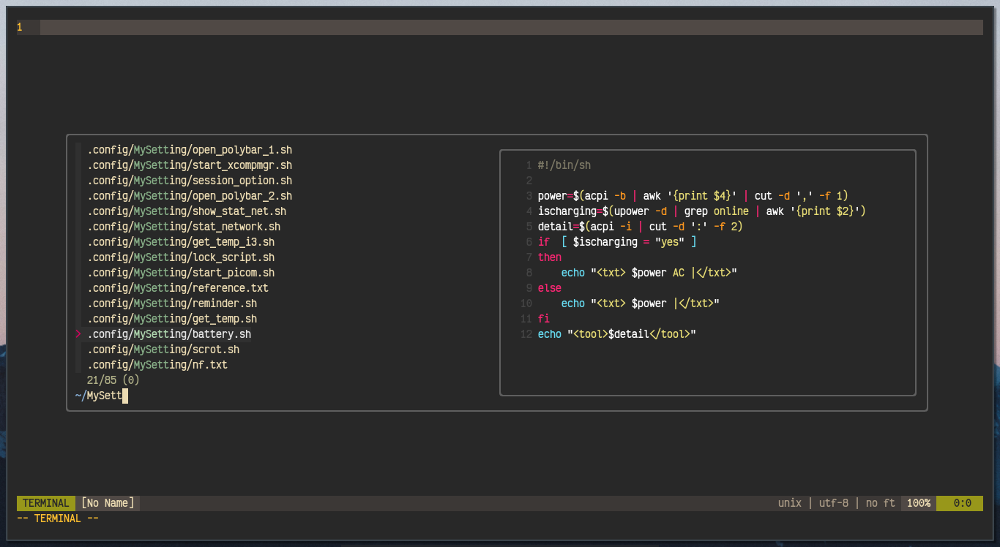
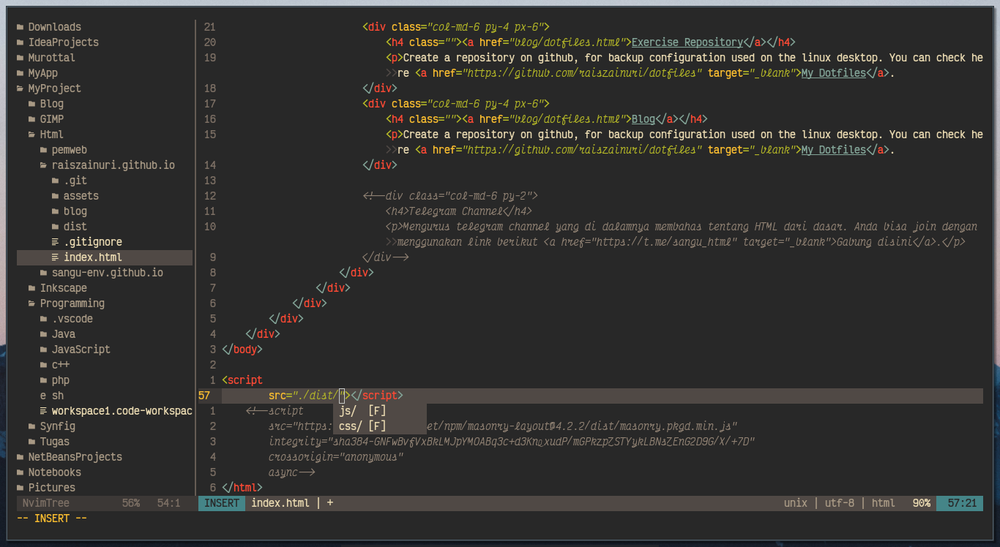

# en-vim
this my repo for backup neovim config,

`Neovim Nightly v0.5.0 (AUR)`

### Screenshoot
|  |
|:--:|
| *finding file* |

|  |
|:--:|
| *java file* |

|  |
|:--:|
| *html file* |

### Installation Guide
1. Install [vim-plug](https://github.com/junegunn/vim-plug) for Plugin Manager
2. Copy `init.vim` and `acc/` folder to config dir ex. `.config/nvim/`, don't forget to backup your old `init.vim`
3. Open `nvim` and run `:PlugInstall`
4. Restart `nvim`

[comment]: <> (`1. Run install.sh 2. If completed, go to neovim and type :PlugInstall 3. Reopen Neovim`)

