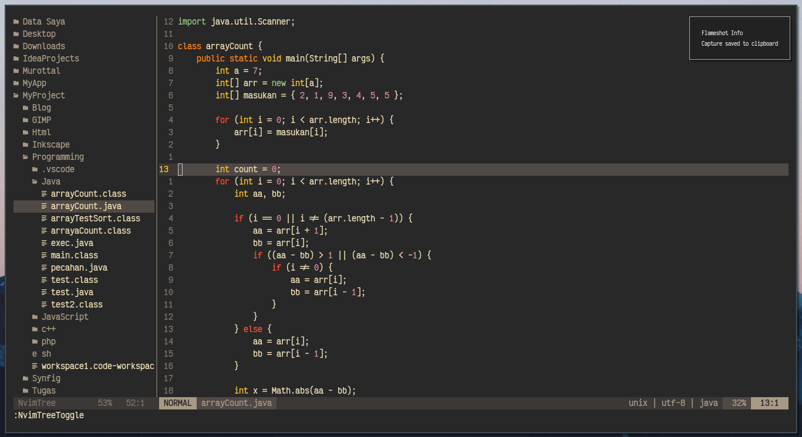

# en-vim
this my repo for backup neovim config,

`Neovim Nightly v0.5.0 (AUR)`

### Screenshoot
|  |
|:--:|
| *finding file* |

|  |
|:--:|
| *java file* |

|  |
|:--:|
| *html file* |

### Installation Guide
1. Run `install.sh`
2. If completed, go to neovim and type `:PlugInstall`
3. Reopen Neovim

